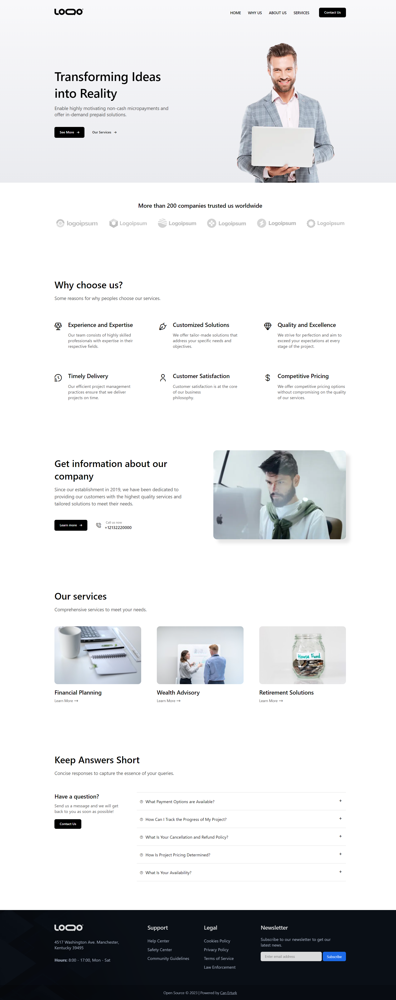

## About this project

This project is a front-end project in which I handle both the design and development process together. To easily update all dimensions within the project as needed, 'rem' was used as the unit of measurement instead of 'px' throughout.

Although it generally includes static elements, I pinned this project because I like its design.

## Tests

> - Unit test for the accordions in the FAQs section: [src/components/\_\_tests\_\_/FaqItem.spec.js](https://github.com/can-erturk/vue-digital-agency/tree/main/src/components/__tests__/FaqItem.spec.js)

## Live demo & Preview

[Click here](https://vue-digital-agency.netlify.app/) to see live demo.

